# Bee Merry Build Instructions

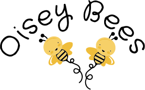 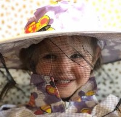

[Oisey Bees on Faceboot](https://www.facebook.com/oiseybees/)

[Buy a Bee Merry on Tindie](https://www.tindie.com/products/hamster/bee-merry-christmas-ornament/)

# Solder Time

Howdy!  Let's get started on building your ornament.

First step, find and lay out all your parts.

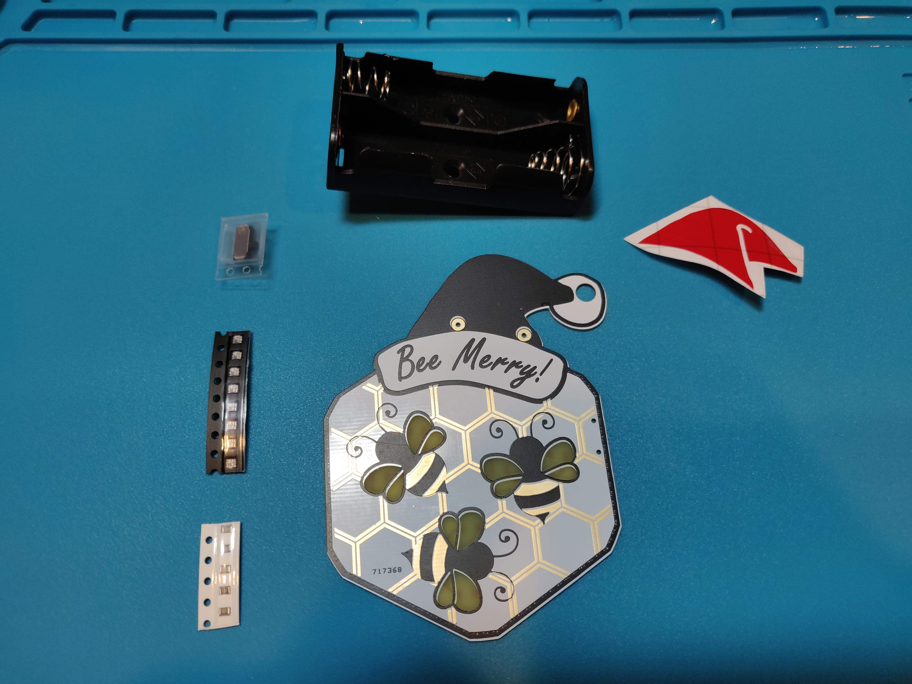

You should have:

* Bee Merry PCB
* Santa Hat sticker
* Battery box
* Black strip of LEDs
* White strip of resistors
* A switch
* Two AA batteries

Heat up your iron and flip the PCB over.  I recommend a decent rosin core solder like a Kester 80/20 leaded solder.  You can use lead-free, though you might find it harder to flow the solder.

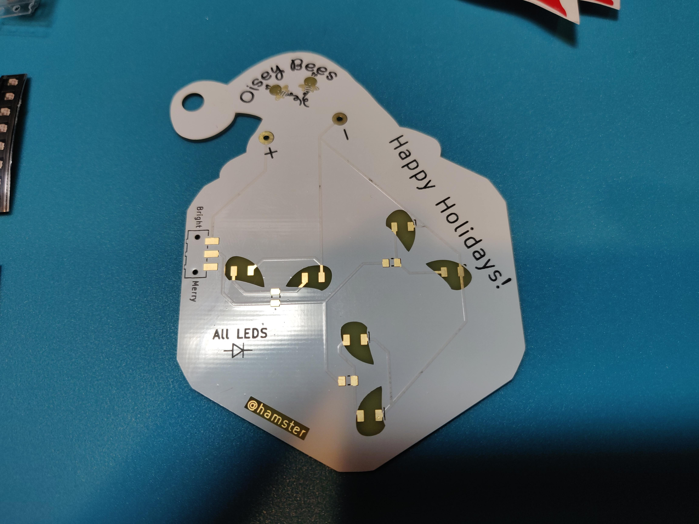

The copper pads are where we are going to solder things on.  The LEDs go in the wing cutout areas.  **Note the 'All LEDs' mark on the lower left** - this shows which way the LEDs need to go.

Take your iron and put down a decent blob on one pad on all the LEDs.  Tin one of the resistor pads with less solder.  Finally, put a little blob on the 3 pads on the left for the switch.

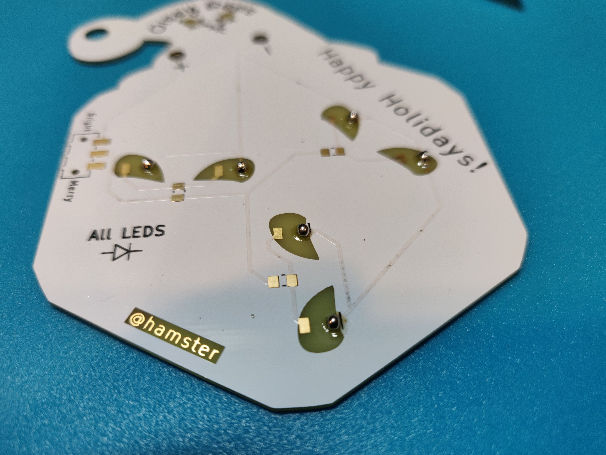

**Important Note** Pay attention to the orientation mark on the lower left of the board.  Some boards will not have the LEDs the same as what is pictured here.

Now, find your LEDs and remove them from the strip.  Flip them over and find the green triangle on the back.  This triangle needs to face in the same direction as the 'All LEDs' triangle, as shown.

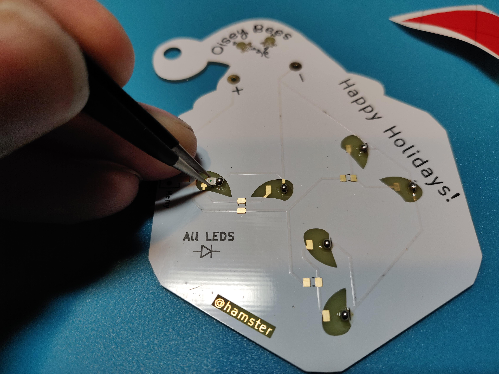

**Important Note** Pay attention to the orientation mark on the lower left of the board.  Some boards will not have the LEDs the same as what is pictured here.

While holding the LED in place, heat the blob of solder and pull the solder up on the LED to join it to the board.  Hold the LED and let it cool.  Solder on all the LEDs this way.  Do the same thing for the resistors, but they don't need to be upside down.

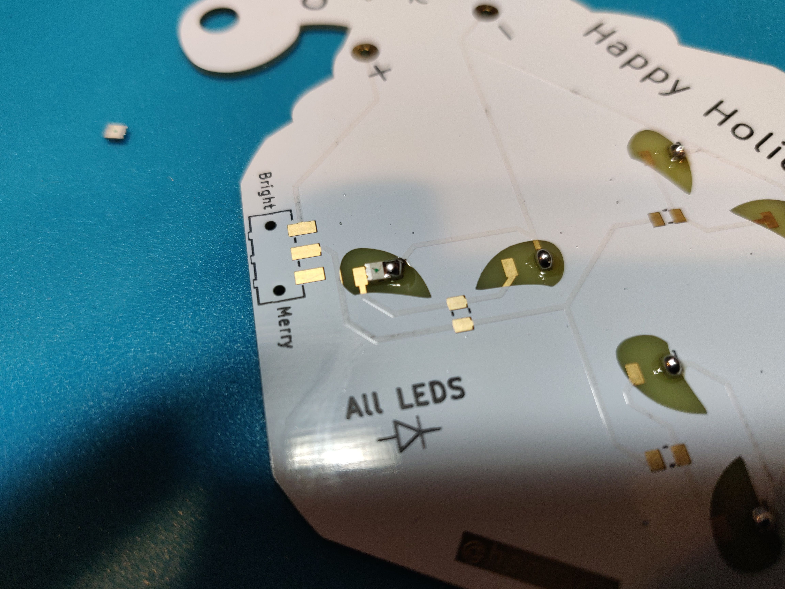

Now take your iron and touch the other side of the LED and the pad at the same time, and feed in some solder.  It should bridge easily.  Remove the iron and let it cool.  Make sure the LED is well soldered - it's OK if it is a little blob-like.

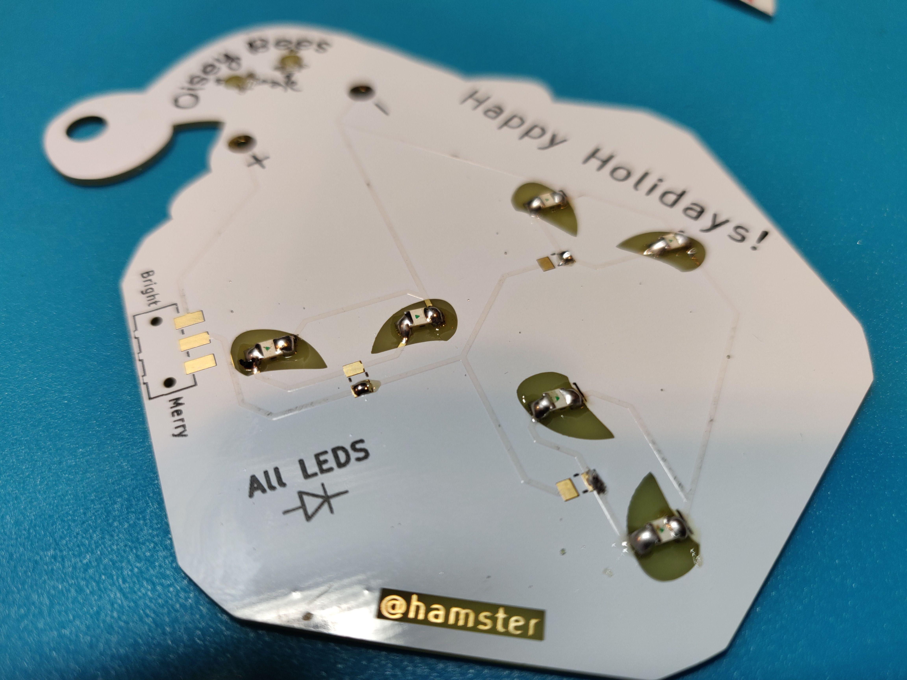

Do the same for the resistor.

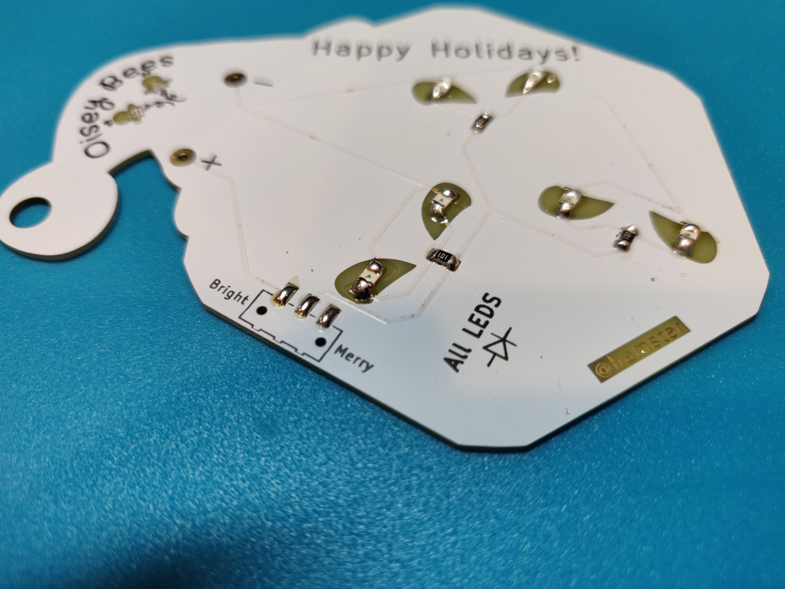

Now take the switch and fit the little plastic pegs into the holes in the PCB.  Hold the switch in place with your finger, then take your iron and push on each leg until it sits down in the solder.

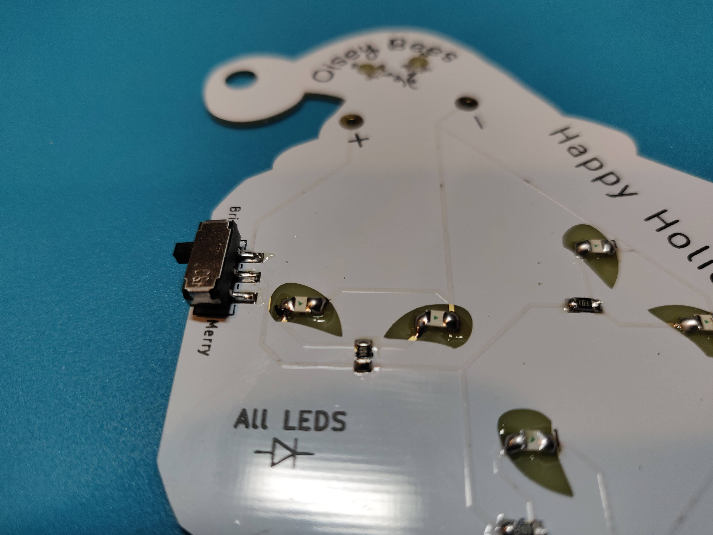

Now, find the battery box and insert its legs into the + and - holes on the back.  Take some flush cutters and cut off the legs flush with the surface of the PCB.  It's OK if they are a little high - you can adjust them a little before you solder them down.

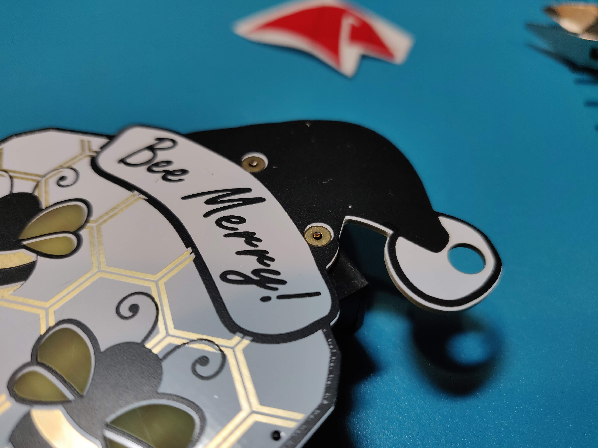

Apply some solder to one pad, and use your thumbnail to adjust the height of the battery box so that the pin is nearly flush.  Do the same for the other pin.  Add a little more solder to dome the connection so it's no longer pointy, unlike as shown in the next photo :)

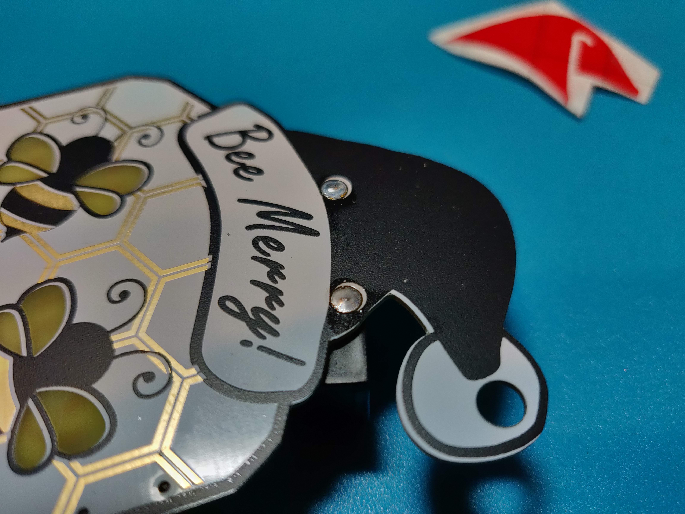

Find your Santa Hat and remove the backing.  Handle the sticker via the clear transfer tape.  Position it over the hat, and center it up.  Then press it down into place and smooth it out.

Finally, grab the edge of the transfer tape, and carefully pull it off.  This step works best if the Santa Hat is stuck well, and you pull as sideways as possible.

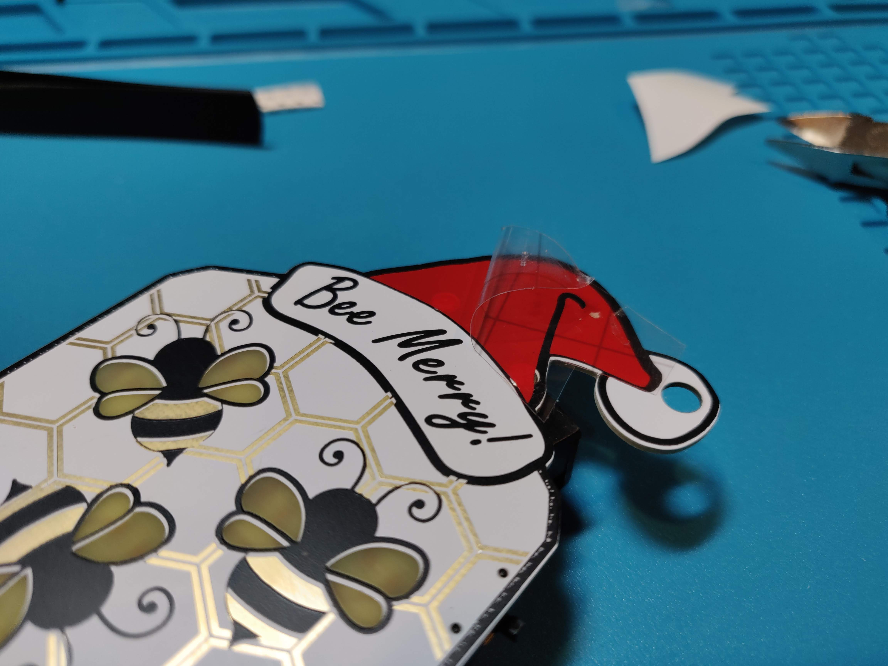

And that's it, you're done!  Install the batteries and turn it on to make sure it's working, and then go hang it up!

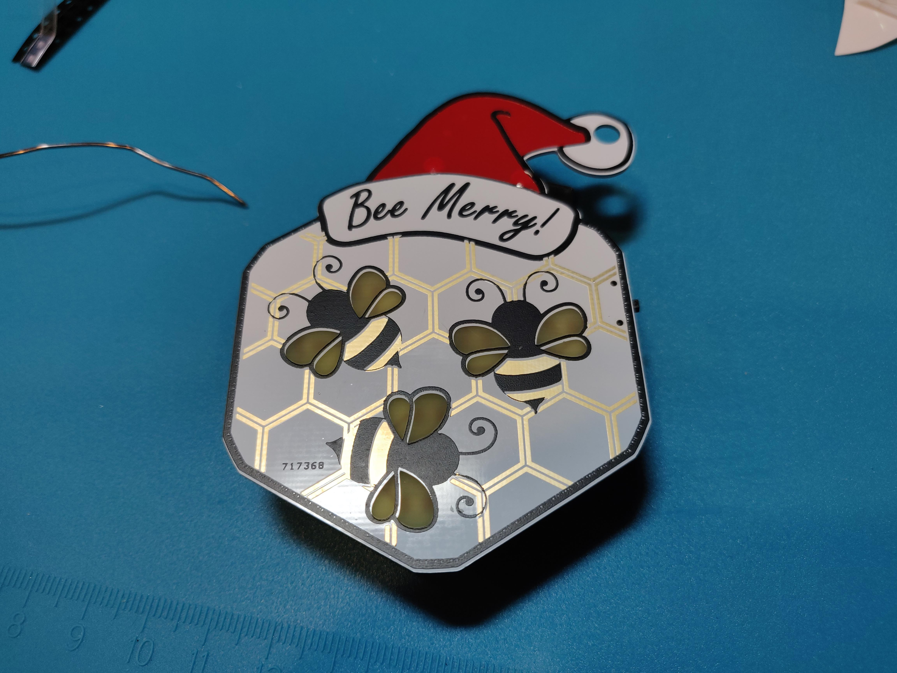
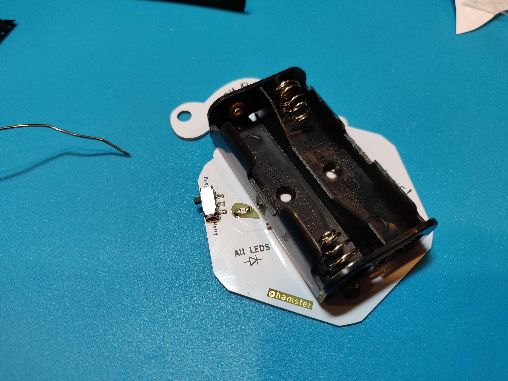

